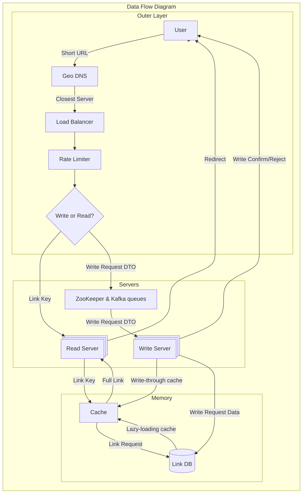
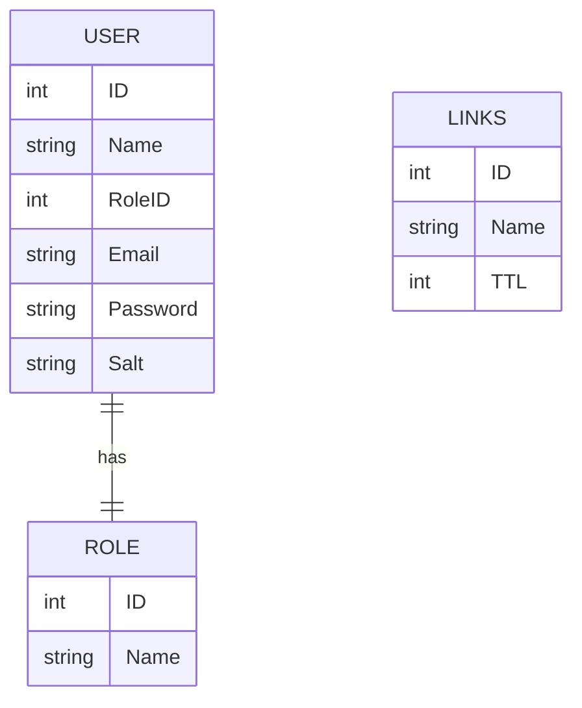

## Оценочные расчёты 

исходя из нефункционального требования масштабируемости — "10 миллионов новых URL в месяц" и "Соотношение чтений (редиректов) к записям (создание URL) — 100:1" 

считаем:
	10 000 000 записей / (30 ⋅ 24 ⋅ 60 ⋅ 60) = **3.85** ≈ **4** запроса на запись в секунду
	-
	10 000 000 записей ⋅ 100 чтений = 1 000 000 000 запросов на чтение за месяц
	-
	1 000 000 000 / (30 ⋅ 24 ⋅ 60 ⋅ 60) = **385** запросов на чтение в секунду
	-
	Записи хранятся ограниченное количество времени — по функциональному требованию 4 — 1 год
	-
	10 000 000 записей в месяц ⋅ 1 год ⋅ 12 месяцев = 120 000 000 записей в год
	120 000 000 записей в год ⋅ 5 лет = **600 000 000** записей на 5 лет
	-
	Допустим, что: 
		URL создаётся из алфавита доступных для URL символов в Base62 (26 английских букв ⋅ 2 + 10 арабских цифр) размером 62 символов.
	-
	Тогда, для обеспечения хорошей защиты от коллизий, при этом сохранив краткость можно использовать 5 символов. Это даст 916 132 832 возможных комбинаций, чего должно хватить на 600 000 000 записей за 5 лет
	-
	Если хранить только ключ без адреса нашего сервиса, то это будет 5 байт на ключ. Соответственно, 
	5 байт ⋅ 600 000 000 записей = 3 000 000 000 байт = 2.79 Гб за 5 лет
	-
	В среднем URL с протоколом занимает [от 25 до 50 знаков](https://www.researchgate.net/publication/360254493_An_Adversarial_Attack_Analysis_on_Malicious_Advertisement_URL_Detection_Framework) — возьмём верхнюю границу в 50 — 50 байт
	50 байт ⋅ 600 000 000 записей = 30 000 000 000 байт = 27.94 Гб за 5 лет
	-
	Добавим к этому время хранения, которое укажем как unix timestamp — 8 байт на запись
	-
	8 байт ⋅ 600 000 000 записей = 4 800 000 000 байт = 4.47 Гб за 5 лет
	-
	Мы также будем хранить пользовательские данные (имя, ID, почта, пароль, соль для пароля, роль для RBAC) и данные о ролях в системе (ID, название роли)
	Поля имеют разную длину, но возьмём среднее значение в 16 символов = 16 байт
	-
	16 байт ⋅ 8 полей = 128 байт на запись
	-
	Также допустим, что не вспе пользователи будут создавать аккаунты. Например, пусть за 5 лет зарегестрируется 1 000 000 пользователей 
	128 байт ⋅ 1 000 000 записей = 128 000 000 = 15.26 Гб
	-
	Итого около 50.46 Гб на 5 лет на 1 реплику
	-
	Возьмём 3 реплики
	50.46 Гб ⋅ 3 = 151.38 Гб
	-
	**итого 151.38 Гб**
## Проектирование API 

Эндпоинты следующие:
	- `/[0-9a-zA-Z]` — поиск ссылки по ключу и перенаправление по ней
	- `/new` — создание ссылки
	- `/upd/[0-9a-zA-Z]` — Изменение ссылки
	- `/del/[0-9a-zA-Z]` — удаление ссылки 
	- `/rep/[0-9a-zA-Z]` — пожаловаться на ссылку
	- `/log` и `/reg` — логин и регистрация соответственно. В основном потребуется для админки/платных фич
## Модель данных

Для скорости обработки пользовательских данных — простые ассоциации ключей и полных ссылок — отлично подойдёт InMemory NoSQL база данных вроде Redis/Valkey. 

Модель данных представляет собой простую пару ключ-значение.
	Время удаления отдельно хранить не нужно, так как в таких СУБД как Redis можно [задать время жизни той или иной записи](https://habr.com/ru/companies/otus/articles/923834/) — после чего она не будет числится в базе данных. 

Также для администрирования и разделения доступа к фичам подразумевается РСУБД (PostgreSQL, MySQL) — хранение данных о пользователе, их роли и их ссылка
## Технические решения

Для получения короткой ссылки можно использовать кодирование Base62, как описано выше. Для получения исходной строки, передаваемой в кодировщик можно использовать следующие стратегии:

- Base62 на основе случайного хэша (пример MD5)
- Base62 на основе инкрементируемого счётчика 
- Base62 на основе хэша с элементом HashRing — общее хранилище делится на N шардов и по первому символу в ключе определяется шард, в котором хранится ключ-значение

В случае если пользователь предлагает кастомный псевдоним, то его нужно проверить в базе данных на коллизии запросом, скоординированным zookeeper (при помощи лока), и если нет коллизии, то ссылка создаётся. В противном случае возвращается ошибка.
### Стратегия кэширования 

В случае с HashRing подойдёт комбинация write-through и lazy-loading стратегий (замедлить запись позволяет перевес в сторону чтения), когда ссылка кэшируется при её запросе, что целесообразно, так как в различных шардах в разных регионах будут свои самые популярные и релевантные ссылки. 

Также, пользуясь функциями многих InMemory СУБД можно расставлять приоритеты кэшируемым ссылкам для того, чтобы в кэше были только самые популярные ссылки. 
## Архитектура

### High level 
#### DataFlow

### Low level 
#### ERD

#### Компоненты системы

Компоненты подобраны с уклоном на доступность сервиса. Допустим, 1 сервер может обработать 100 запросов в секунду. Допустим, что 1 инстанс СУБД может обработать 300–500 запросов в секунду (из расчётов на основе бенчмарков [Redis](https://redis.io/docs/latest/operate/oss_and_stack/management/optimization/benchmarks/) и [PostgreSQL](https://www.8host.com/blog/testirovanie-proizvoditelnosti-upravlyaemoj-bazy-dannyx-postgresql-s-pomoshhyu-pgbench/))

- GeoDNS для распределения запросов на наиболее близкие сервера
- Сами сервера в каждой значительной логической гео-зоне
    - 2 сервера для записи
    - 4–6 серверов для чтения
- apache kafka и apache zookeeper для координации записи
- Кэш для самых популярных ссылок на уровне приложения (Redis, memcached)
- БД со всеми данными — 3 реплики для redundancy. Работа по принципу passive-active. централизована для консистентности данных, но шардирована по разным регионам для уменьшения задержек
### Анализ узких мест

- Не удаётся предсказать, занят ли ключ, предложенный пользователем вплоть до отправки запроса

	- однако, можно предположить, что ссылки с псевдонимами будут гораздо популярнее, чем случайные хэши ввиду своей простоты. следовательно, можно ускорить процесс валидации, проверяя псевдонимы с кэшем. при их кэшировании hit or miss, самые популярные ссылки окажутся в кэше и почти мгновенно будут выдавать ошибку при использовании дублированного псевдонима
	
	- тем не менее, такой подход внедряет больший риск коллизий среди большего множества непопулярных ссылок, поэтому он не столь оправдан. также, так как по задаче нам не требуется ускорять создание ссылок, это узкое место можно опустить
	
- С использованием алгоритма HashRing есть вероятность неравномерного распределения хэшей

- Сильно нагружен узел записи и управления ссылками — он отвечает за слишком большое количество задач по управлению ссылками и профилями пользователей. Тем не менее, сервис в первую очередь рассчитан на редирект ссылок, поэтому этот аспект инфраструктуры можно масштабировать позже за счёт создания новых инстансов сервиса или разделения их на микросервисы авторизации и создания/удаления ссылок

- В случае необходимости удаления ссылки модератором при асинхронной синхронизации на InMemory БД кэш инвалидируется не сразу, поэтому удалённая ссылка может работать ещё некоторое время
