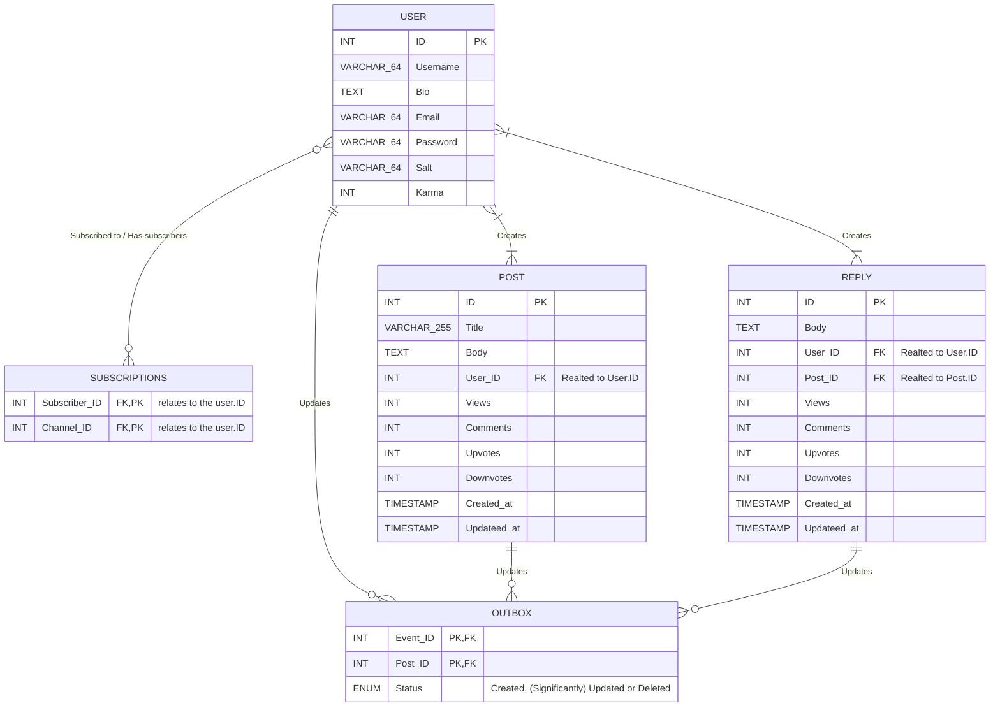
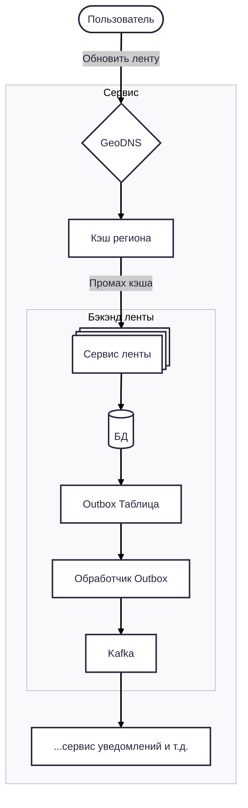
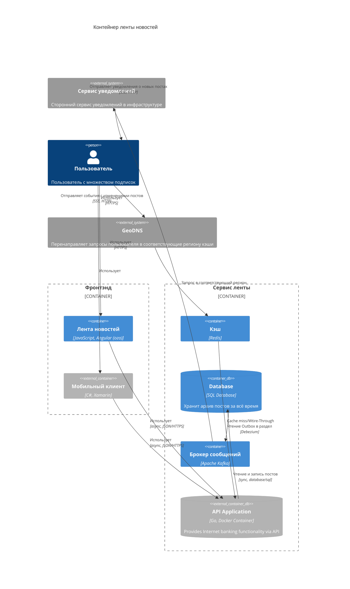
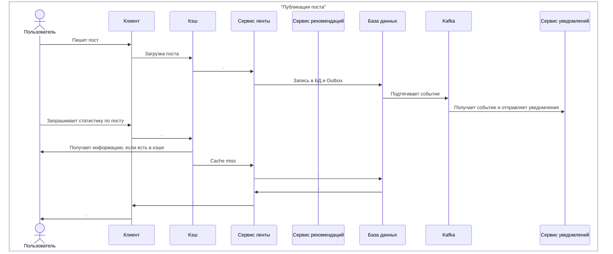
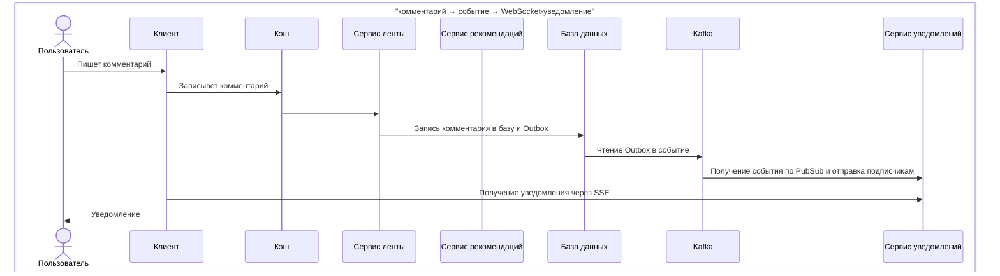

# Лабораторная работа №2: Проектирование рекомендательной ленты для социальной сети 

## Постановка задачи 

> К вам обратился Product Owner популярной социальной сети, с целью обеспечить доступ пользователя к контенту даже на парковке. Ваша задача – спроектировать архитектуру сервиса ленты постов для социальной сети. Пользователь подписывается на авторов, видит их новые посты в своей персональной ленте, может открывать комментарии и получать уведомления о новых событиях почти в реальном времени.
## Функциональные требования:

1. Регистрация/логин, управление профилем.  — обязательно Rate Limiting, система репортов и админка
    
2. Подписка/отписка на авторов.	— Паттерн Publisher-subscriber через Server-Side Events
    
3. Публикация постов (текст + опциональные медиа-ссылки).   — не нужны хранилища S3 — посты plain text
    
4. Просмотр персональной ленты с бесконечной прокруткой (пагинация по курсору, а не по offset).	— фокус на BASE вместо ACID, нужна быстрая бд и/или кэши; можно сделать Cassandra, если не нужен полнотекстовый поиск
    
5. Добавление и чтение комментариев к постам.
    
6. Уведомления в реальном времени о новых постах подписок и новых комментариях к моим постам. — SSE!
## Нефункциональные требования:

1. Низкая задержка чтения ленты: p95 < 150 мс для партии из 20 элементов.
    
2. Высокая пропускная способность записи комментариев (бурсты до 10k RPS без 5xx).
    
3. Горизонтальное масштабирование ключевых компонентов.
    
4. Устойчивость к сбоям брокера/воркеров: события не теряются
    
5. Идемпотентность обработчиков событий и безопасная повторная доставка
## Задания:

1. Оценочные расчёты

- Оцените суточные и пиковые RPS:
    > На запись пиковая нагрузка 10K RPS (из текста задания). Сложно сказать про среднесуточную без контекста масштаба и позиционирования сети, но предположим, что раз у нас соцсеть с лентой новостей где все всё обсуждают, то нагрузка довольно большая — 1/10 от пиковой — 1K RPS
    > Нагрузка на чтение не указана ни в цифрах, ни в соотношении, но имеет смысл предположить, что в большинстве случаев пользователи будут читать посты, а не писать их, поэтому возьмём соотношении чтение/запись 100/1 — итого 100K RPS средняя и 1M RPS пиковая
    
- публикация постов;
    > Опять же, зависит от контекста — но возьмём соотношение комментарий/пост 10/1
    
- доставки постов в ленты;
    > Доставка постов в ленту (т.е. её формирование) будет происходить при запросе пользователя — соответственно имеем те же цифры запросов на чтение. Причём доставка относительно быстрая за счёт легковесностии самих постов — plain text
    
- чтение ленты (партии по 20);
    > При загрузке партий по 20 в ленту каждого пользователя, с учётом алгоритма формирования ленты (описан далее) — необходимо будет загружать по 100 постов (ID и/или посты целиком) для пользователя наперёд
    
- запись/чтение комментариев.
    > Наконец, чтобы читать недавние посты и ответы к комментариям в реальном времени мы воспользуемся Server Side Events, за счёт которого новейшие обновления на сервере будут сразу направляться пользователю на клиент
    
- Оцените объём хранения на 1 и 3 года: посты (метаданные), индексы ленты, комментарии, кэш.
    > Посты представляют собой текст и возможно ссылки на медиа из сторонних источников (по условию задачи), поэтому не потребуют больших объёмов хранилища. Допустим, что пост в среднем занимает 1000 знаков, что равно 2000 байт на пост
    > Допустим, у поста есть простые метаданные в виде счётчиков — просмотры, лайки/дизлайки, количества комментариев/ответов, дата публикации и изменения — на каждый из  6 счётчиков выделим дополнительно по 8 байт → 6 × 8 = 48 байт на пост
    > Такой подход применим и к комментариям — посчитаем их аналогично, но учтём, что их количество будет в разы больше — как ранее упоминалось, 10/1
    > Индексы обычно занимают 10% от индексируемых данных — из рассчёта 2048 байт: 205 байт
    >
    > Итого: 2253 байт на пост
    >
    > Из расчётов выше возьмём 1K RPS за среднее количество постов в секунду. Тогда за 1 год:
    >	1000 × 60 × 60 × 24 × 365 = 31536000000 байт ≈ 30 Гб
    > Учтём ещё два бэкапа для redundnacy:
    >	30 * 3 = 90 Гб
    >
    > Итого за 3 года с бэкапом в 2 экземплярах
    >	90 * 3 = 270 Гб
    
- Заложите бюджет на рост в 3 раза без архитектурных изменений.
    > Согласно расчётам по инфраструктуре в популярных облачных провайдерах (Yandex Cloud, Timeweb, Selectel, VK Cloud) — Kafka + MongoDB (3 реплики по 90 Гб) + Kubernetes (3 мастер ноды и 3 воркера) + Redis (15 Гб 3 ноды) — даст нам цену в районе 20–50 тыс. ₽ в месяц. Yandex Cloud выпадает из этих провайдеров по цене, поэтому бюджет на рост в 3 раза нужно закладывать в районе 30 тыс. ₽ в месяц

2. Модель данных (логическая)

- Реляционный контур (users, posts, subscriptions, outbox_events): ключи, уникальности, транзакционные границы.

    
- Хранилище ленты
    > Ленту скорее всего будет формировать отдельный сервис с рекомендательным алгоритмом, поэтому нужно сохранить гибкость алгоритма. Допустим, эту ленту делает отдельный сервис, который подгружает и анализирует посты с централизованной БД сервиса ленты
    > 
    > Тогда для каждого пользователя на чтение предоставим N постов, которые будут подгружаться как самые релевантные из сервиса рекомендаций. Пусть это будет размер батча × 5 = 20 × 5 = 100 постов
    > 
    > Для быстрого доступа к актуальным постам в регионе кэша, при записи поста пользователем можно также сохранять пост в кэше через Write Back с короткой задержкой 

- Комментарии: схема под запрос «N последних по посту, сортировка по времени».
    >  Стратегия Write Back предоставляет очень большую скорость работы с меняющимся постом (когда на него ставят реакции и пишут комментарии сразу после публикации), поэтому хорошо подойдёт под этот сценарий
    >  
    >  Комментарии можно хранить как отсортированное множество (sorted set) в Redis и по запросу брать оттуда N последних
    
- Опишите, что и где кэшируется для гидратации постов по ID.
    > В кэше для каждого пользователя в регионе предоставлено место для 100 свежих постов с коротким TTL. При проверке ленты пользователь запрашивает батчи по 20 постов из ленты
    > 
    > Если TTL постов закончился или случился cache miss, запрос идёт к сервису формирования ленты, который из централизованного хранилища подтягивает ещё 100 свежих ID постов
    > 
    > В любом случае гидратация постов происходит запросом также сначала на кэш, а потом в центральную БД 

3. Технические решения (сравнение и выбор)

- Стратегия формирования ленты
    > Лента формируется на отдельном сервисе и запрашивается с его эндпоинта при каждом cache miss для пользователя — кэш получает ID постов для ленты пользователя
    
- Пагинация для infinite scroll	— на основе курсора
    > Далее, по курсору (SCAN в Redis) выбираются самые новые и популярные посты (новизна + просмотры/рейтинг). При отсутствии этих постов в кэше, делается запрос на основную БД

- Outbox/Transactional messaging
    > Для того, чтобы обеспечить идемпотентную (много запросов — одно изменение) и надёжную (сохранение в случае сбоя) запись в кэше и БД, мы используем Kafka с паттерном Outbox
    > Асинхронная запись изменений в БД увеличит пропускную способность и надёжность транзакций, но всё ещё не застраховано от случаев сбоя в брокере сообщений — даже с учётом внутренней идемпотентной обработки Kafka синхронизацию с БД можно потерять в случая сбоя брокера
    > Поэтому в БД в таблицу Outbox мы сохраняем сообщение о новом посте, его изменении или удалениичтобы потом сохранить лог действия с постом и обновить запись соотвествующим образом в БД
    
- Идемпотентность и повторная доставка
    > Доставлять посты нужно хотя бы 1 раз (at-least-once) — для этого будет использован паттерн Outbox описаный выше
    
- Гидратация: порядок источников (кэш → сервис постов), размеры батчей, таймауты и деградация.
    >  Батчи для клиента могут быть по 20 постов — plain-text контент лёгкий, и (по условию "с парковки") скорее всего будет запрашиваться с мобильного клиента, который с головой покроют эти 20 постов
    
- Бэкап/восстановление и репликация для разных хранилищ.
    > Бэкап основной БД можно сделать путём простой репликации Active-Passive с 3 репликами — в приоритете запись, чтения редкие (только в случае cache miss)
    > 
    > Кэши нужно развернуть по принципу Active-Active, т.к. важна не только низкая задержка, но и большая пропускная способность, так как используется кэширование write-back

4. Нарисуйте UML-диаграммы

- Component / Container (уровень микросервисов, шина событий, хранилища, кэш).
High-level


Container

    
- Sequence (три сценария):
    

1. публикация поста с Outbox и доставкой события;



2. чтение ленты с курсором и гидратацией;
 ```mermaid
sequenceDiagram

  

box "Чтение ленты с курсором и гидратацией"

actor User as Пользователь

participant Client as Клиент

participant Cache as Кэш

participant Server-feed as Сервис ленты

participant Server-rec as Сервис рекомендаций

participant Database as База данных

participant Kafka as Kafka

participant Server-notif as Сервис уведомлений

end

  

User->>Client: Запрос постов

Client->>Cache: .

Cache->>Client: Получает посты из кэша через SCAN

Client->>User: Контент

  

Cache->>Server-feed: Cache-miss

Server-feed->>Server-rec: Запрос рекомендаций

Server-rec->>Database: Поиск подходящих постов

Database->>Server-rec: ID искомых постов

Server-rec->>Server-feed: .

Server-feed->>Cache: Подгрузка ID постов

Cache->>Client: .

Client->>Cache: Запрос на посты ID [1, 2, ...]

Cache->>Client: Получает посты из кэша

Client->>User: Контент

  

Cache->>Server-feed: Cache-miss

Server-feed->>Database: .

Database->>Server-feed: .

Server-feed->>Cache: Подгрузка постов по ID

Cache->>Client: Получает посты из кэша через SCAN

Client->>User: Контент    
```

2. комментарий → событие → WebSocket-уведомление.



- Deployment (узлы/контейнеры, масштабирование, внешние зависимости).

![[Pasted image 20251118181613.png]]

Подразумевается горизонтальное масштабирование и репликация для повышения надёжности и пропускной способности (не указано в схеме во избежание дубликатов)

- Class/Data (логическая модель для реляционной части + стереотипы/примечания для нереляционной).
