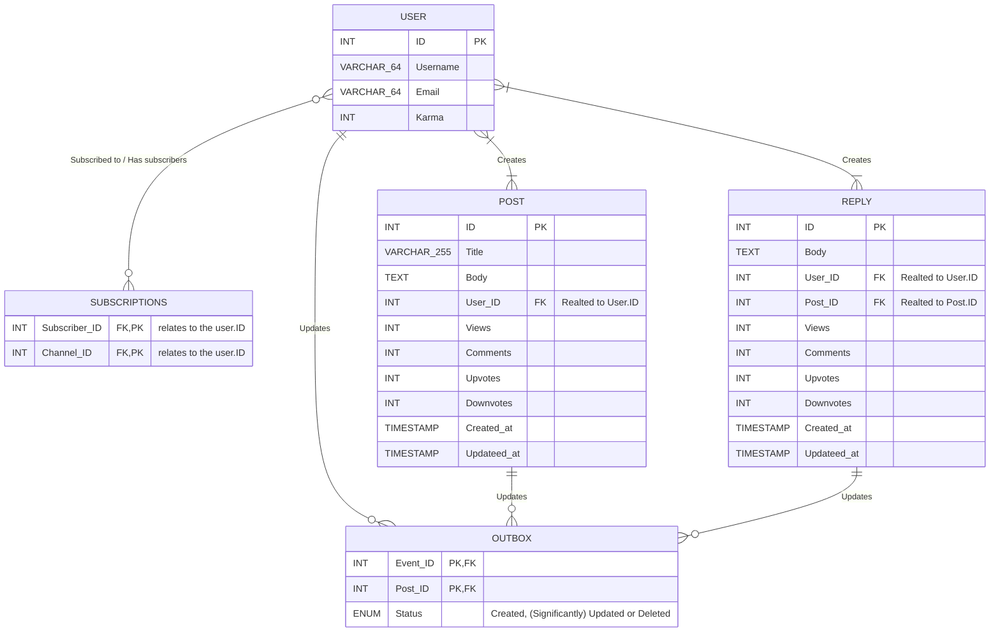
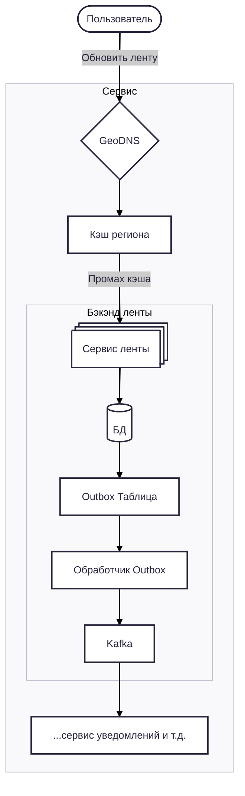

# Лабораторная работа №2: Проектирование рекомендательной ленты для социальной сети 

## Постановка задачи 

> К вам обратился Product Owner популярной социальной сети, с целью обеспечить доступ пользователя к контенту даже на парковке. Ваша задача – спроектировать архитектуру сервиса ленты постов для социальной сети. Пользователь подписывается на авторов, видит их новые посты в своей персональной ленте, может открывать комментарии и получать уведомления о новых событиях почти в реальном времени.
## Функциональные требования:

1. Регистрация/логин, управление профилем.  — обязательно Rate Limiting, система репортов и админка
    
2. Подписка/отписка на авторов.	— Паттерн Publisher-subscriber через Server-Side Events
    
3. Публикация постов (текст + опциональные медиа-ссылки).   — не нужны хранилища S3 — посты plain text
    
4. Просмотр персональной ленты с бесконечной прокруткой (пагинация по курсору, а не по offset).	— фокус на BASE вместо ACID, нужна быстрая бд и/или кэши; можно сделать Cassandra, если не нужен полнотекстовый поиск
    
5. Добавление и чтение комментариев к постам.
    
6. Уведомления в реальном времени о новых постах подписок и новых комментариях к моим постам. — SSE!
## Нефункциональные требования:

1. Низкая задержка чтения ленты: p95 < 150 мс для партии из 20 элементов.
    
2. Высокая пропускная способность записи комментариев (бурсты до 10k RPS без 5xx).  — Подзаморочиться с Load Balancer'ом и избежать узких мест в записи в БД
    
3. Горизонтальное масштабирование ключевых компонентов.	— Будет сделано, шеф!
    
4. Устойчивость к сбоям брокера/воркеров: события не теряются — Kafka? Ну, почему нет / Outbox-паттерн
    
5. Идемпотентность обработчиков событий и безопасная повторная доставка. — Kafka однозначно — он умеет переиспользовать события, поэтому на уровне бизнес-логики/Kafka можно предусмотреть идемпотентность
## Задания:

1. Оценочные расчёты

- Оцените суточные и пиковые RPS:
    > На запись пиковая нагрузка 10K RPS (из текста задания). Сложно сказать про среднесуточную без контекста масштаба и позиционирования сети, но предположим, что раз у нас соцсеть с лентой новостей где все всё обсуждают, то нагрузка довольно большая — 1/10 от пиковой — 1K RPS
    > Нагрузка на чтение не указана ни в цифрах, ни в соотношении, но имеет смысл предположить, что в большинстве случаев пользователи будут читать посты, а не писать их, поэтому возьмём соотношении чтение/запись 100/1 — итого 100K RPS средняя и 1000K RPS пиковая
    
- публикация постов;
    > Опять же, зависит от контекста — но возьмём соотношение комментарий/пост 10/1
    
- доставки постов в ленты;
    > Для доставки поста в ленту нужно иметь кэш в который загружаются недавно опубликованные посты, которые затем считываются из кэша клиентом пользователя, если он подписан на эти источники
    
- чтение ленты (партии по 20);
    > Кэшировать абсолютно все посты не получится, но имеет смысл кэшировать наиболее популярные (с точки зрения данных аналитики) источники в регионе кэша
    > Хорошей стратегией может оказаться кэширование постов опубликованных непосредственно в этом регионе. Тогда можно будет минимизировать задержку между публикацией поста источником и чтением этого поста его подписчиками в регионе
    
- запись/чтение комментариев.
    > Наконец, чтобы читать недавние посты и ответы к комментариям в реальном времени мы воспользуемся Server Side Events, за счёт которого новейшие обновления на сервере будут сразу направляться пользователю на клиент
    
- Оцените объём хранения на 1 и 3 года: посты (метаданные), индексы ленты, комментарии, кэш.
    > Посты представляют собой текст и возможно ссылки на медиа из сторонних источников (по условию задачи), поэтому не потребуют больших объёмов хранилища. Допустим, что пост в среднем занимает 1000 знаков, что равно 2000 байт на пост
    > Допустим, у поста есть простые метаданные в виде счётчиков — просмотры, лайки/дизлайки, количества комментариев/ответов, дата публикации и изменения — на каждый из  6 счётчиков выделим дополнительно по 8 байт → 6 × 8 = 48 байт на пост
    > Такой подход применим и к комментариям — посчитаем их аналогично, но учтём, что их количество будет в разы больше — как ранее упоминалось, 10/1
    > Индексы обычно занимают 10% от индексируемых данных — из рассчёта 2048 байт: 205 байт
    >
    > Итого: 2253 байт на пост
    >
    > Из расчётов выше возьмём 1K RPS за среднее количество постов в секунду. Тогда за 1 год:
    >	1000 × 60 × 60 × 24 × 365 = 31536000000 байт ≈ 30 Гб
    > Учтём ещё два бэкапа для redundnacy:
    >	30 * 3 = 90 Гб
    >
    > Итого за 3 года с бэкапом в 2 экземплярах
    >	90 * 3 = 270 Гб
    
- Заложите бюджет на рост в 3 раза без архитектурных изменений.
    

2. Модель данных (логическая)

- Реляционный контур (users, posts, subscriptions, outbox_events): ключи, уникальности, транзакционные границы.

    
- Хранилище ленты
    > Из произведённых ранее расчётов, пост в среднем занимает 2253 байта и представляет собой plain text, поэтому их можно эффективно кэшировать с текстом и метаданными
    > Из рассчёта каэша на 2 Гб, мы можем взять 2 × 1024³ / 2253 ≈ 953166 постов

- Комментарии: схема под запрос «N последних по посту, сортировка по времени».
    
- Опишите, что и где кэшируется для гидратации постов по ID.
    

3. Технические решения (сравнение и выбор)

- Стратегия формирования ленты
    > Лента сначала формируется в кэше региона, чтобы самые актуальные посты грузились почти мгновенно. Пул постов формируется пушем недавно опубликованных в регионе по стратегии Write-Through (клиент → кэш → БД). При заполнении кэша отбрасываются самые старые записи 
    > Это даст органичное формирование пула, но в случае, если постов будет мало, приведёт к деградации кэша. Эту проблему можно решить путём установки маленького таймаута кэша (12–24 часов). Встаёт проблема пустого места в кэше
    > Тогда, можно второстепенно ранжировать записи по популярности. Так, из кэша будут удаляться самые старые и непопулярные посты. Можно рассчитать соотношение новых/популярных постов (допустим 10/1), и дополнительно кэшировать загруженные на клиент посты, чтобы потом также отсеивать по новизне и просмотрам/лайкам
    > Поиск постов и запрос их с общей БД не предусмотрен, но нужен для новых пользователей. В таком случае запрос на пост изначально идёт на кэш и только потом в случае промаха идёт на общую БД

- Пагинация для infinite scroll	— на основе курсора
    > При запросе как на кэш, так и на основную Базу данных самые новые и популярные посты выбираются на основе составного курсора (новизна + просмотры/рейтинг)

- Outbox/Transactional messaging
    > Для того, чтобы обеспечить идемпотентную запись в кэше и БД, мы используем Kafka с паттерном Outbox
    > Асинхронная запись изменений в БД увеличит пропускную способность и надёжность транзакций, но всё ещё не застраховано от случаев сбоя в брокере сообщений — даже с учётом внутренней идемпотентной обработки Kafka синхронизацию с БД можно потерять в случая сбоя брокера
    > Поэтому в БД в таблицу Outbox мы сохраняем сообщение о новом посте, его изменении или удалениичтобы потом сохранить лог действия с постом и обновить запись соотвествующим образом в БД
    
- Идемпотентность и повторная доставка
    > Доставлять посты нужно хотя бы 1 раз (at-least-once) 
    
- Гидратация: порядок источников (кэш → сервис постов), размеры батчей, таймауты и деградация.
    > Таймауты и деградация описаны выше. Батчи для клиента могут быть по 20 постов — plain-text контент лёгкий, и (по условию "с парковки") скорее всего будет запрашиваться с мобильного клиента, который с головой покроют эти 20 постов
    
- Бэкап/восстановление и репликация для разных хранилищ.
    > Бэкап основной БД можно сделать путём простой репликации Active-Passive с 3 репликами для Redundancy. Кэши нужно развернуть по принципу Active-Active, т.к. важна не только низкая задержка, но и большая пропускная способность, так как используется репликация write-through

4. Нарисуйте UML-диаграммы

- Component / Container (уровень микросервисов, шина событий, хранилища, кэш).
Уровень микросервисов

    
- Sequence (три сценария):
    

1. публикация поста с Outbox и доставкой события;
    
2. чтение ленты с курсором и гидратацией;
    
3. комментарий → событие → WebSocket-уведомление.
    

- Deployment (узлы/контейнеры, масштабирование, внешние зависимости).
    
- Class/Data (логическая модель для реляционной части + стереотипы/примечания для нереляционной).
