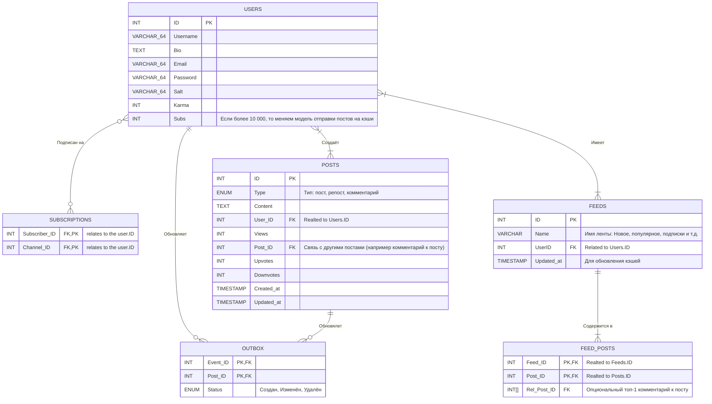
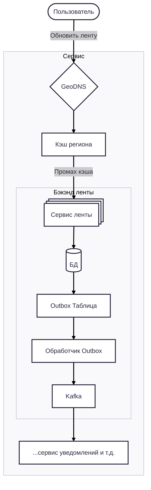
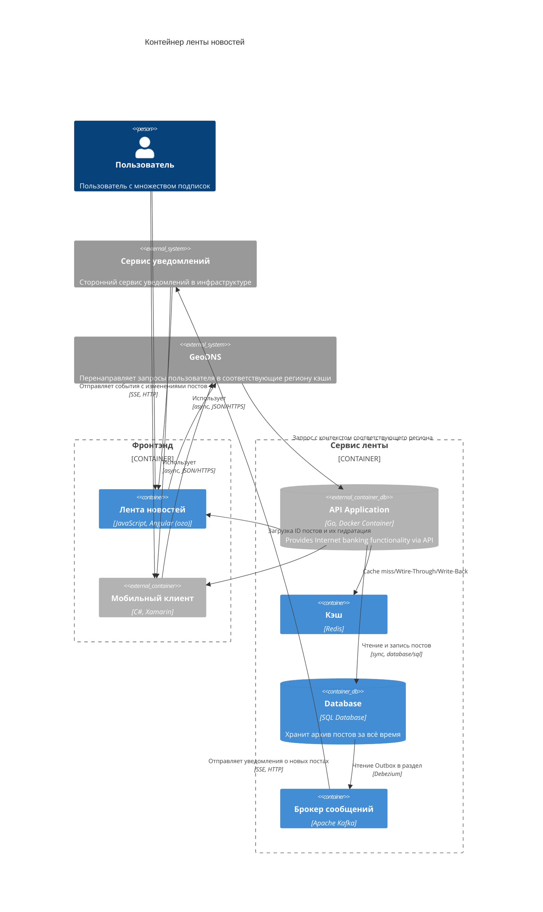
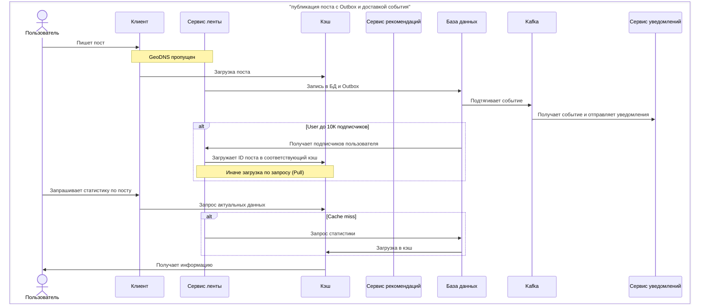
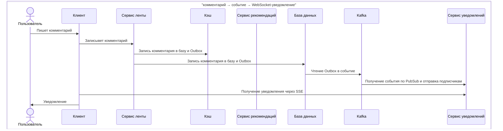

# Лабораторная работа №2: Проектирование рекомендательной ленты для социальной сети 

## Постановка задачи 

> К вам обратился Product Owner популярной социальной сети, с целью обеспечить доступ пользователя к контенту даже на парковке. Ваша задача – спроектировать архитектуру сервиса ленты постов для социальной сети. Пользователь подписывается на авторов, видит их новые посты в своей персональной ленте, может открывать комментарии и получать уведомления о новых событиях почти в реальном времени.
## Функциональные требования:

1. Регистрация/логин, управление профилем. 
    
2. Подписка/отписка на авторов.
    
3. Публикация постов (текст + опциональные медиа-ссылки).   — не нужны хранилища S3 — посты plain text
    
4. Просмотр персональной ленты с бесконечной прокруткой (пагинация по курсору, а не по offset).
    
5. Добавление и чтение комментариев к постам.
    
6. Уведомления в реальном времени о новых постах подписок и новых комментариях к моим постам. 
## Нефункциональные требования:

1. Низкая задержка чтения ленты: p95 < 150 мс для партии из 20 элементов.
    
2. Высокая пропускная способность записи комментариев (бурсты до 10k RPS без 5xx).
    
3. Горизонтальное масштабирование ключевых компонентов.
    
4. Устойчивость к сбоям брокера/воркеров: события не теряются
    
5. Идемпотентность обработчиков событий и безопасная повторная доставка
## Задания:

1. Оценочные расчёты

- Оцените суточные и пиковые RPS:
    > На запись пиковая нагрузка 10K RPS (из текста задания). Сложно сказать про среднесуточную без контекста масштаба и позиционирования сети, но предположим, что раз у нас соцсеть с лентой новостей где все всё обсуждают, то нагрузка довольно большая — 1/10 от пиковой — 1K RPS
    > Нагрузка на чтение не указана ни в цифрах, ни в соотношении, но имеет смысл предположить, что в большинстве случаев пользователи будут читать посты, а не писать их, поэтому возьмём обычное соотношение чтение/запись 100/1 — итого 100K RPS средняя и 1M RPS пиковая
    
- публикация постов;
    > Предположим, среднестатистический пользователь будет публиковать 5 постов в день. Тогда в год мы имеем 
    > 
    > 5 × 365 = 1825 постов в год от 1 пользователя
    
- доставки постов в ленты;
    > Подгружать будем партии из 100 постов (точнее их ID, а затем гидратировать) на пользователя — ID является BIGINTом и весит 8 байт (64-битный Integer)
    
- чтение ленты (партии по 20);
    > Из рассчётов объёма данных на пост далее и кол-во подгружаемых постов для пользователя в худшем случае (все пользователи региона грузят разные посты):
    > 
    > 100 × 8 + 100 × 629 = 800 + 62900 = 63700 байт ≈ **62** Кб на 1 пользоватлея региона без подгрузки комментариев
    > 
    > Допустим, мы подгружаем к каждому посту по топ-3 комментария
    > 
    > 63700 + 300 × 8 + 300 × 629 = 254800 байт ≈ **249** Кб  на 1 пользователя региона

- запись/чтение комментариев.
    > С учётом 629 байт на пост и соотношением посты/комментарии 1/10 имеем
    > 
    > 629 × 11 = 6919 байт суммарно
    
- Оцените объём хранения на 1 и 3 года: посты (метаданные), индексы ленты, комментарии, кэш.
    > Посты представляют собой текст и возможно ссылки на медиа из сторонних источников (по условию задачи), поэтому не потребуют сторонних объектных хранилищ 
    > 
    > Допустим, что пост в среднем занимает 250 знаков, что равно **500** байт на пост
    > 
    > Допустим, у поста есть простые метаданные в виде счётчиков — просмотры, лайки/дизлайки, количества комментариев/ответов, дата публикации и изменения — на каждый из  6 счётчиков выделим дополнительно по 8 байт → 9 × 8 = **72** байта на пост
    > 
    > Индексы обычно занимают 10% от индексируемых данных — из рассчёта 572 байта: **57** байт
    >
    > Итого: **629** байт на пост
    >
    > Из расчётов выше возьмём 1K RPS за среднее количество записей (постов и комментариев) в секунду. Тогда за 1 месяц:
    >	629 × 1000 × 60 × 60 × 24 × 30 = 1630368000000 байт ≈ **1519** Гб 
    >	
    > Учтём ещё два бэкапа для redundnacy:
    >	1519 × 3 = **4557** Гб
    >	
    > На 1 год:
    > 	4557 × 12 = **54684** Гб
    >
    > Итого за 3 года с бэкапом в 2 экземплярах
    >	54684 * 3 = **164052** Гб
    
- Заложите бюджет на рост в 3 раза без архитектурных изменений.
	> От текущей конфигурации — PostgreSQL + Kubernetes (3 master 2 worker) + Redis/Valkey + Kafka
	> 
	> Рост в обработке данных — 1 год, 1519 Гб данных, 10K RPS  → 4557 Гб, 30K RPS — Реплики не учитываются, т.к. рассчитываются отдельно 
	> 
    > Согласно расчётам по инфраструктуре в популярных облачных провайдерах (Yandex Cloud, Timeweb, Selectel, VK Cloud) 
    > - Kafka (ВМ с Kafka) 
    > - Managed PostgreSQL (3 реплики по 1519 Гб) 
    > - Managed Kubernetes (3 мастер ноды и 2 воркера) 
    > - Redis или Valkey (8 Гб)
    >  
    > Даст нам цену в районе 60–80 тыс. ₽ в месяц
    ![[Pasted image 20251129170847.png]]
    ![[Pasted image 20251129170903.png]]
> ![[Pasted image 20251129171313.png]]


2. Модель данных (логическая)

- Реляционный контур (users, posts, subscriptions, outbox_events): ключи, уникальности, транзакционные границы.

```mermaid
erDiagram

SUBSCRIPTIONS {
    INT Subscriber_ID FK,PK "relates to the user.ID"  
    INT Channel_ID FK,PK "relates to the user.ID"  
}

USERS {
    INT ID PK ""  
    VARCHAR_64 Username  ""  
    TEXT Bio ""
    VARCHAR_64 Email  ""  
    VARCHAR_64 Password ""
    VARCHAR_64 Salt ""
    INT Karma  ""  
    INT Subs "Если более 10 000, то меняем модель отправки постов на кэши"
}

FEEDS {
	INT ID PK ""
	VARCHAR Name "Имя ленты: Новое, популярное, подписки и т.д."
	INT UserID FK "Related to Users.ID"
	TIMESTAMP Updated_at "Для обновления кэшей"
}

FEED_POSTS {
	INT Feed_ID PK,FK "Realted to Feeds.ID"
	INT Post_ID PK,FK "Realted to Posts.ID"
	INT[] Rel_Post_ID FK "Опциональный топ-1 комментарий к посту"
}

POSTS {
    INT ID PK ""  
    ENUM Type "Тип: пост, репост, комментарий"
    TEXT Content  ""  
    INT User_ID FK "Realted to Users.ID"  
    INT Views  ""  
    INT Post_ID FK "Связь с другими постами (например комментарий к посту)"
    INT Upvotes  ""  
    INT Downvotes  ""  
    TIMESTAMP Created_at  ""  
    TIMESTAMP Updated_at  ""  
}

OUTBOX {
    INT Event_ID PK,FK ""  
    INT Post_ID PK,FK ""  
    ENUM Status  "Создан, Изменён, Удалён"  
}

USERS}|--|{POSTS:"Создаёт"
USERS||--o{OUTBOX:"Обновляет"
USERS}o--o{SUBSCRIPTIONS:"Подписан на"
POSTS||--o{OUTBOX:"Обновялет"
USERS}|--|{FEEDS:"Имеет"
FEEDS||--|{FEED_POSTS:"Содержится в"
```
    
- Хранилище ленты
	> Лента представляет собой категоризированный (Новое, Популярное и т.д.) контейнер ссылок на посты, подобранные для конкретного пользователя (User_ID)
	> 
    > Ленту скорее всего будет формировать отдельный сервис с рекомендательным алгоритмом, поэтому нужно сохранить гибкость алгоритма. Допустим, эту ленту делает отдельный сервис, который подгружает и анализирует посты с централизованной БД сервиса ленты — шардированной РСУБД (например PostgreSQL) 
    > 
    > Тогда для каждого пользователя на чтение предоставим N постов, которые будут подгружаться как самые релевантные из сервиса рекомендаций. Пусть это будет размер батча × 5 = 20 × 5 = 100 постов
    > 
    > Для быстрого обновления данных к актуальным постам в регионе кэша, но также для быстрой записи на базу данных, используется Write Back с короткой задержкой 

- Комментарии: схема под запрос «N последних по посту, сортировка по времени».
	> Для подгрузки комментариев 
    >  Стратегия Write Back предоставляет очень большую скорость работы с меняющимся постом (когда на него ставят реакции и пишут комментарии сразу после публикации), поэтому хорошо подойдёт под этот сценарий
    >  
    >  При загрузке поста в кэш с базы данных также берутся N самых популярных и новых комментариев (Eager Loading)
    
- Опишите, что и где кэшируется для гидратации постов по ID.
    > В кэше для каждого пользователя в регионе предоставлено место для 100 свежих ID постов с коротким TTL
    > При проверке ленты пользователь запрашивает батчи по 20 постов из ленты
    > 
    > Если TTL постов закончился или случился cache miss (пользователь исчерпает 100 постов), запрос идёт к сервису формирования ленты, который из централизованного хранилища подтягивает ещё 100 свежих ID постов
    > 
    > Получив ID постов, клиент запрашивает их у сервиса, который также смотрит их сначала в кэше, а потом подгружает с централизованной БД то, что не нашлось в кэше 

3. Технические решения (сравнение и выбор)
>	Для централизованного хранения постов в сервисе ленты применим **PostgreSQL** с шардированием — это сильно улучшит производительность с (ранее высчитаным) большим объёмом данных и позволит избежать проблемы знаменитости на уровне базы данных — контент знаменитости, занимающий большое место в базе скорее всего распределится по разным шардам, минуя проблему горячих ключей
>	
>	Для кэширования записей и большинства чтений применим Redis/Valkey — будем кэшировать как ленты пользоватлей, так и самые популярные и актуальные посты в регионе — те, которые пользователи из этого региона публикуют
>	Для быстрого обновления кэша поставим короткий TTL и во избежание проблемы N+1 будем использовать стратегию Eager Loading — С каждым постом мы также кэшируем N самых популярных и новых комментариев

- Стратегия формирования ленты
    > Обычно лента формируется из рекомендаций, которые подгружаются в кэш как контейнер ID постов, подобранных для пользователя. Далее, при заходе в ленту новостей, ID запрашиваются с кэша, и подгружаются с базы данных при cache miss 
    > 
    > Новые посты сразу доступны в своём актуальном регионе, так как пишутся сразу в кэш — Write Through — и отправляются подписчикам при помощи Push-модели 
    > 
    > Чтобы избежать проблемы знаменитостей воспользуемся **гибридной моделью** — пользователи с более чем 10К подписчиков переходят на модель pull для досылки постов — уведомления всё ещё посылаются как было указано (т.к. обрабатываются сторониим сервисом), но сами посты в кэшах не подгружаются — вместо этого они грузятся только с обновлением ленты. Для других пользователей остаётся стратегия push
    > 
    > Как трейдофф гибридной модели — для популярных пользователей имплементировать Write Back с быстрым реагированием на новые лайки и комментарии к посту, а для менее популярных — Write Through для простой подгрузки в ленты "Рядом с вами"
    
- Пагинация для infinite scroll	— на основе курсора
    > Далее, по курсору (SCAN в Redis) выбираются самые новые и популярные посты (новизна + просмотры/рейтинг) среди кэшированных ID. При отсутствии этих постов в кэше, делается запрос на основную БД

- Outbox/Transactional messaging
    > Для того, чтобы обеспечить идемпотентную (много запросов — одно изменение) и надёжную (сохранение в случае сбоя даже Kafka) запись в кэше и БД, мы используем Kafka с паттерном Outbox
    > 
    > Асинхронная запись изменений в БД увеличит пропускную способность и надёжность транзакций, но всё ещё не застраховано от случаев сбоя в брокере сообщений — даже с учётом внутренней идемпотентной обработки Kafka синхронизацию с БД можно потерять в случая сбоя брокера (сервис не поймёт какие сообщения не обработал брокер)
    > 
    > Поэтому в БД в таблицу Outbox мы сохраняем сообщение о новом посте, чтобы потом сохранить лог действия с постом и отправить соответствующее событие сервису уведомлений. Только после полной обработки в этом цикле мы помечаем это событие как завершённое или откатываемся, если получили ошибку на любом этапе обработки
    
- Идемпотентность и повторная доставка
    > Также паттерн Outbox обеспечит доставку постов ровно 1 раз, если не считать сбои сети, которые никогда не гарантируют 100% доставку сообщения (проблема 2 генералов)
    
- Гидратация: порядок источников (кэш → сервис постов), размеры батчей, таймауты и деградация.
    >  Батчи для клиента могут быть по 20 постов — plain-text контент лёгкий, и (по условию "с парковки") скорее всего будет запрашиваться с мобильного клиента, который с головой покроют эти 20 постов
    
- Бэкап/восстановление и репликация для разных хранилищ.
    > Бэкап основной БД можно сделать путём простой репликации Active-Passive — в приоритете запись, чтения редкие (только в случае cache miss) — с 3 репликами — стандартное правило 3-2-1 — 3 инстанса, 2 в инфраструктуре (1 основной, 1 быстрый бэкап) и 1 сторониий бэкап на случай отказа основной ноды
    > 
    > Кэши нужно развернуть по принципу Active-Active, т.к. важна не только низкая задержка, но и большая пропускная способность

4. Нарисуйте UML-диаграммы

- Component / Container (уровень микросервисов, шина событий, хранилища, кэш).
High-level

```mermaid
---
config:
  theme: redux
---
flowchart TD
    A(["Пользователь"]) -- Обновить ленту --> B{"GeoDNS"}
    subgraph Сервис
    B --> C["Кэш региона"]
    C -- Промах кэша --> n1@{ shape: procs, label: "Сервис ленты"}
    subgraph Бэкэнд ленты
    n1 --> n2@{ shape: cyl, label: "БД"}
    n2 --> n3["Outbox Таблица"]
    n3 --> n4["Обработчик Outbox"]
    n4 --> n5["Kafka"]
    end
    n5 --> n6["...сервис уведомлений и т.д."]
    end
```

Container

```mermaid
---

config:

theme: mc

---

C4Container

title Контейнер ленты новостей

Person(user, Пользователь, "Пользователь с множеством подписок", $tags="v1.0")

System_Ext(notif_system, "Сервис уведомлений", "Сторонний сервис уведомлений в инфраструктуре", $tags="v1.0")

Container_Boundary(c1, "Фронтэнд") {

Container(spa, "Лента новостей", "JavaScript, Angular (ого)")

Container_Ext(mobile_app, "Мобильный клиент", "C#, Xamarin")

}

  

Container_Boundary(c2, "Сервис ленты") {

ContainerDb_Ext(backend_api, "API Application", "Go, Docker Container", "Provides Internet banking functionality via API")

Container(cache, "Кэш", "Redis")

ContainerDb(database, "Database", "SQL Database", "Хранит архив постов за всё время")

Container(kafka, "Брокер сообщений" "Apache Kafka")

  

}

  

System_Ext(geodns, "GeoDNS", "Перенаправляет запросы пользователя в соответствующие региону кэши")

  

Rel(user, spa, "", "")

Rel(user, mobile_app, "", "")

Rel(spa, geodns, "Использует", "async, JSON/HTTPS")

UpdateRelStyle(spa, geodns, $offsetY="-80")

Rel(mobile_app, geodns, "Использует", "async, JSON/HTTPS")

UpdateRelStyle(mobile_app, geodns, $offsetX="-50", $offsetY="-40")

Rel(geodns, backend_api, "Запрос с контекстом соответствующего региона")

Rel(backend_api, cache, "Cache miss/Wtire-Through/Write-Back")

Rel_Back(database, backend_api, "Чтение и запись постов", "sync, database/sql")

UpdateRelStyle(database, backend_api, $offsetY="60")

Rel(database, kafka, "Чтение Outbox в раздел", "Debezium")

Rel(backend_api, spa, "Загрузка ID постов и их гидратация")

UpdateRelStyle(backend_api, spa, $offsetY="15", $offsetX="50")

Rel(backend_api, mobile_app, "")

Rel(kafka, notif_system, "Отправляет события с изменениями постов", "SSE, HTTP")

UpdateRelStyle(kafka, notif_system, $offsetX="-350", $offsetY="-310")

Rel(notif_system, spa, "", "")

Rel(notif_system, mobile_app, "Отправляет уведомления о новых постах", "SSE, HTTP")

UpdateRelStyle(notif_system, mobile_app, $offsetX="90", $offsetY="660")
```
    
- Sequence (три сценария):
    

1. публикация поста с Outbox и доставкой события;


```mermaid
sequenceDiagram

  

box "публикация поста с Outbox и доставкой события"

actor User as Пользователь

participant Client as Клиент

participant Server-feed as Сервис ленты

participant Cache as Кэш

participant Server-rec as Сервис рекомендаций

participant Database as База данных

participant Kafka as Kafka

participant Server-notif as Сервис уведомлений

end

  

User->>Client: Пишет пост

Note over Client,Server-feed: GeoDNS пропущен

Client->>Cache: Загрузка поста

Server-feed->>Database:Запись в БД и Outbox

Database->>Kafka: Подтягивает событие

Kafka->>Server-notif: Получает событие и отправляет уведомления

alt User до 10К подписчиков

Database->>Server-feed: Получает подписчиков пользователя

Server-feed->>Cache: Загружает ID поста в соответствующий кэш

Note over Server-feed,Cache: Иначе загрузка по запросу (Pull)

end

  

User->>Client: Запрашивает статистику по посту

Client->>Cache: Запрос актуальных данных

alt Cache miss

Server-feed->>Database: Запрос статистики

Database->>Cache: Загрузка в кэш

end

Cache->>User: Получает информацию
```

2. чтение ленты с курсором и гидратацией;
 ```mermaid
sequenceDiagram
box "Чтение ленты с курсором и гидратацией"

actor User as Пользователь

participant Client as Клиент

participant Server-feed as Сервис ленты

participant Cache as Кэш

participant Server-rec as Сервис рекомендаций

participant Database as База данных

end

  

User->>Client: Запрос постов

Note over Client,Server-feed: GeoDNS пропущен

Client->>Cache: Запрос 20 ID постов

alt Cache miss для ID постов

Server-feed->>Server-rec: Запрос рекомендаций

Server-rec->>Database: Поиск подходящих постов

Database->>Server-rec: ID искомых постов и их комментарии

Server-rec->>Server-feed: .

Server-feed->>Cache: Подгрузка ID постов и их комментариев

end

Cache->>Client: Получает ID 20 постов

Client->>Cache: Запрос на посты ID [1, 2, ...] и их комментарии

  

alt Cache miss постов

Server-feed->>Database: Запрос на посты по ID и их комментарии

Database->>Server-feed: .

Server-feed->>Cache: Подгрузка постов по ID

end

Cache->>Client: Получает посты из кэша через SCAN

Client->>User: Контент
```

2. комментарий → событие → WebSocket-уведомление.


```mermaid
sequenceDiagram

  

box "комментарий → событие → WebSocket-уведомление"

actor User as Пользователь

participant Client as Клиент

participant Server-feed as Сервис ленты

participant Cache as Кэш

participant Server-rec as Сервис рекомендаций

participant Database as База данных

participant Kafka as Kafka

participant Server-notif as Сервис уведомлений

end

  

User->>Client: Пишет комментарий

Client->>Server-feed: Записывет комментарий

Server-feed->>Cache: Запись комментария в базу и Outbox

Server-feed->>Database: Запись комментария в базу и Outbox

Database->>Kafka: Чтение Outbox в событие

Kafka->>Server-notif: Получение события по PubSub и отправка подписчикам

Client->>Server-notif: Получение уведомления через SSE

Client->>User: Уведомление
```

- Deployment (узлы/контейнеры, масштабирование, внешние зависимости).

![[Pasted image 20251118181613.png]]

Подразумевается горизонтальное масштабирование и репликация для повышения надёжности и пропускной способности (не указано в схеме во избежание дубликатов)

- Class/Data (логическая модель для реляционной части + стереотипы/примечания для нереляционной).
